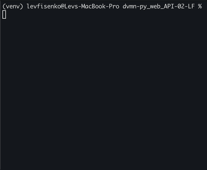

# Сокращение ссылок или подсчет кликов

Программа сокращает ссылки (url) или считает количество кликов по ранее сокращенным ссылкам с помощью api.vk.

### Как установить

Для начала Вам нужно зарегистрироваться в социальной сети [vk.com](https://vk.com/). Затем необходимо получить [сервисный ключ доступа (токен)](https://id.vk.com/about/business/go/docs/ru/vkid/latest/vk-id/connection/tokens/service-token), его можно получить после создания [приложения](https://id.vk.com/about/business/go/docs/ru/vkid/latest/vk-id/connection/create-application). Далее необходимо создать файл `.env` в директории программы и записать в первую строку `API_VK_TOKEN = ваш токен`.

Python3 должен быть уже установлен. 
Затем используйте `pip` (или `pip3`, есть конфликт с Python2) для установки зависимостей:
```
pip install -r requirements.txt
```
Рекомендуется использовать [virtualenv/venv](https://docs.python.org/3/library/venv.html) для изоляции проекта.

### Как использовать

Запускаем терминал - Terminal (macOS), Windows Terminal (cmd.exe). Переходим в директорий программы.



### Цель проекта

Код написан в образовательных целях на онлайн-курсе для веб-разработчиков [dvmn.org](https://dvmn.org/).